# FIFA-2021-DATASET-CLEANING
## #Datacleaningchallenge

# INTRODUCTION 
Data cleaning challenge #datacleaningchallenge was organized by Promise Nonso and Victor Somadina amongst other professional in the data industry. The challenge was organized for both newbies and professionals where we all collaborated to help each other learn and grow. The main medium of communication was telegram which accommodated about 2000 people from all over the world. All data enthusiast beginner, intermediate and expert all came together dedicating their time to anybody who has challenges in cleaning the data. Participant was encouraged to use the tool he/she knows how to use in other to perfect his/her skills and tools such as Excel, Power BI, SQL, Python, R and Google sheets were used and different subgroups was created using Telegram.

# ABOUT THE DATASET 
The FIFA 2021 dataset was originally gotten from [Kaggle.com](https://www.kaggle.com/datasets/yagunnersya/fifa-21-messy-raw-dataset-for-cleaning-exploring) and it contains information about **18,979** football players and **77** columns. Some of the columns are ID, Name, LongName, Age, Nationality. The dataset also has a data dictionary to familiarize with the date before cleaning. 

# BACKGROUND 
The dataset was from [Kaggle.com](https://www.kaggle.com/datasets/yagunnersya/fifa-21-messy-raw-dataset-for-cleaning-exploring) it was a messy data that needs to be cleaned before any analysis can be done. The data dictionary was used in familiarizing with the data. During the data cleaning or cleansing process, I detect corrupt, inaccurate, incomplete, irrelevant parts in records of the data, and also replace and modify the coarse data. To me, filter is an eye in seeing what is in the data. We can’t scroll around thousands of rows; so that best thing is to check using the filter; which row is cleaned and not. Filter is one of the best tools when it comes to data cleaning.

The dataset consists of 18,979 records and 77 columns and after the data cleansing the records are **189,978 and 78 fields** because some fields have to be modified like the **Contract**, to have the **Agreement Type** and the **Contract Duration** while the **Positions** the **No of positions** played. This can be used when you want to analysis the data and have insight on how many position has he never played for the club and which position is he good at. The M Language was used and conditional column to clean the data in **Power BI**.  
 
# PROJECT OBJECTIVE 
The main aim of this project is data cleaning and made available the data for analysis. 

**What to look out for in the data** 
1.	Incorrect Data type 
2.	Spelling Errors and values 
3.	Duplicate entry
4.	Null entries 
5.	Irrelevant data 
6.	Unnecessary symbols in the column headings 

# CLEANING PROCESS 
**_Note:_** _Before the cleaning of the dataset, I backup the original file in a safe place in case of errors in the working dataset_. 

1.	**_Data Extracting:_** The data was sent into the telegram group chat and a reference to the site for more insight in on the dataset. The data was download as a Common Separated Value (CSV) along with the data dictionary. And the data dictionary was read to have full understanding of what the dataset is all about. And data was imported into Power BI for cleaning 

2. **_Data Exploration:_** The data was viewed and a lot of errors, inaccuracy and inconsistency was discovered in the data e.g. the Name, LongName, Wages, Value, Release Clause column etc. has non-printed characters, inappropriate datatype  
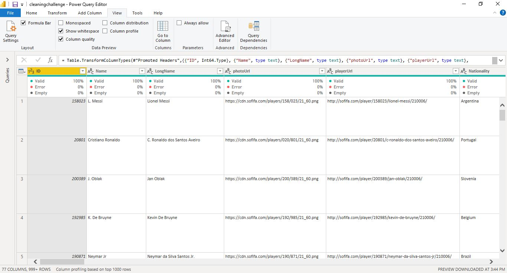

3.	**_Data Cleaning:_** In other to make this dataset ready and available for analysis, the step-by-step process used in cleaning the dataset is prescribed below. 

   -	**_Club:_** After the Importing the Dataset into Power BI, in the Power Query Mode, there was much space between the rows that needs to be cleaned and the club column  was the source of this. So, my first step was to trim the club column. And it was done by clicking on **Transform**, **Navigating to format** and **clicking on Trim** 

| Before | After|
|:--------------------:|:--------------------:|
|  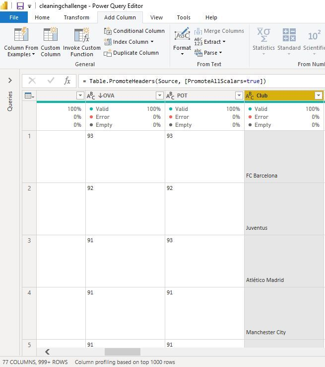 | 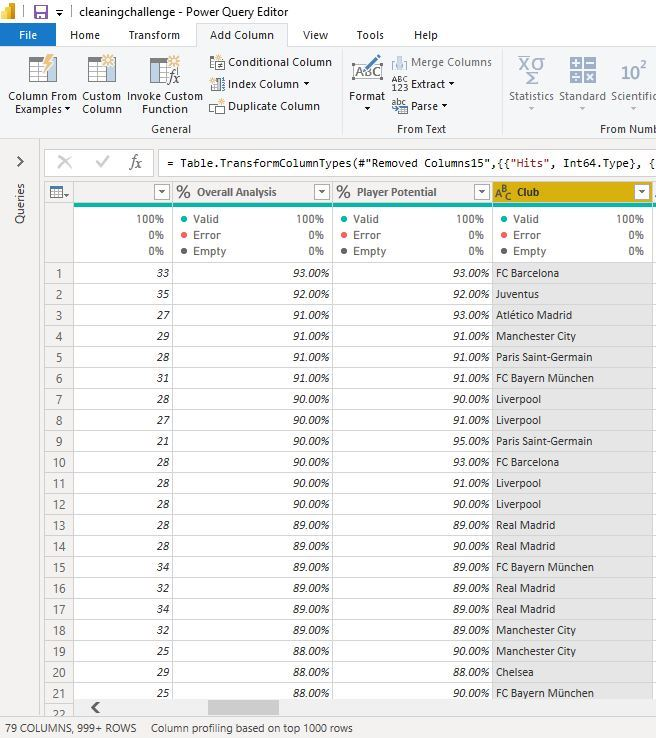 |

   - **_Name:_** This column has special character in it. So, in order to remove this, I replace the special character with the player’s first name “S” Stefan. The players first name was gotten from the LongName Column by using the filter to filter the Longname column and by deselecting all other names in order to have more insight about that particular row. 

Before   |   After 
:-----------------------:|:-----------------------:
 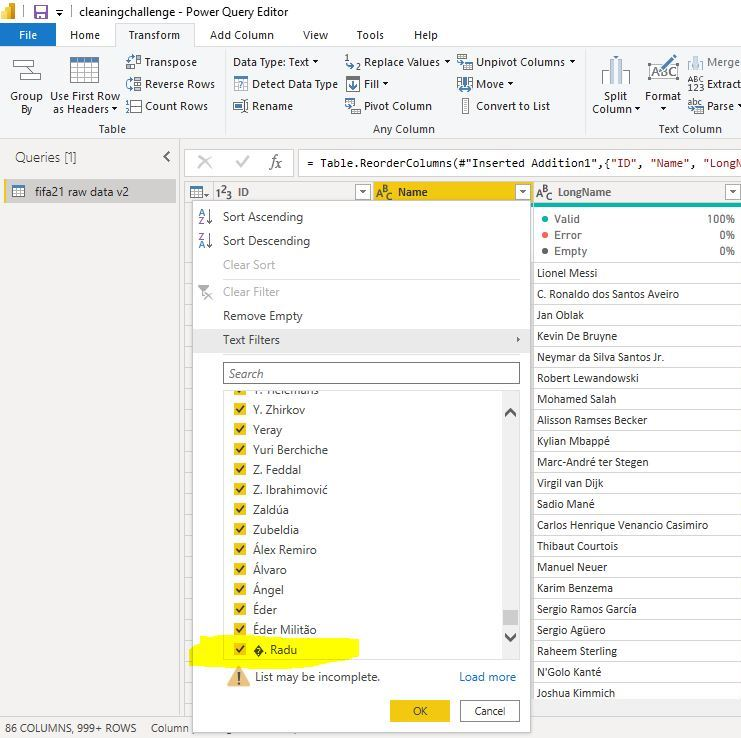 |  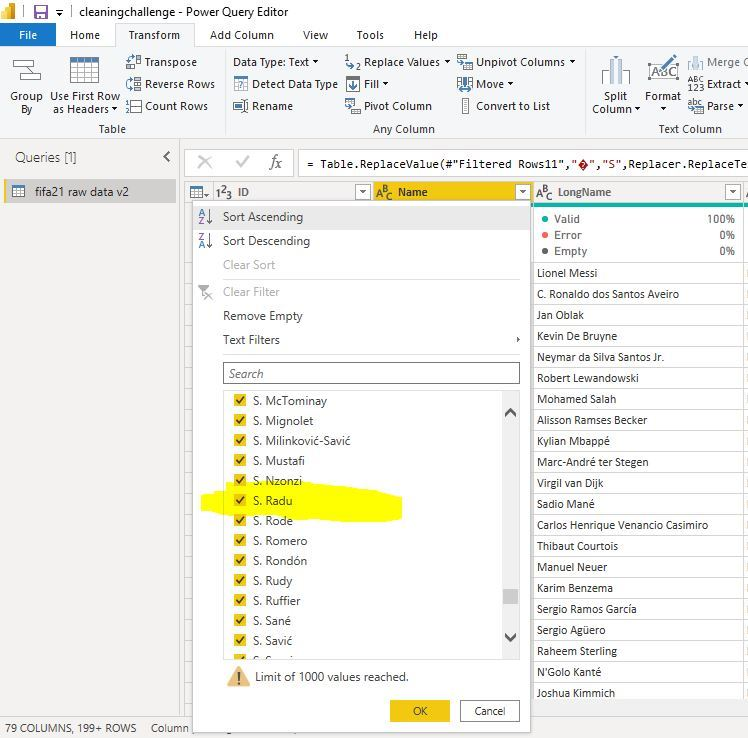 

  - **_ Photo URL and Player URL: _** Gives more information about the player and their photos since these columns won’t be used for analysis, these columns was removed from the dataset. 
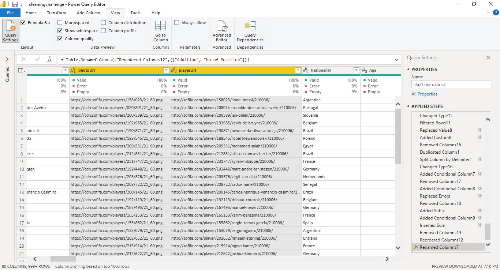

  -  **_Nationality and Age:_** These Columns had no missing values and data type is correct. These columns are for the analysis. 
  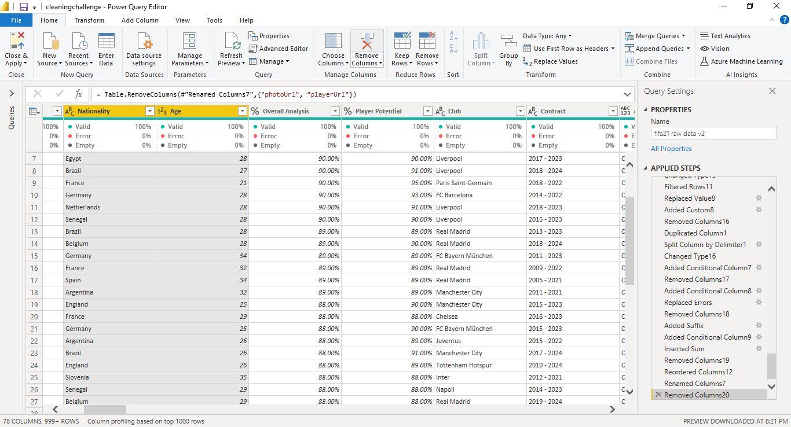 
  
  - **_OVA and POT:_** OVA means Players Overall Analysis or rate in percentage and POT Players Potential in percentage according to the data dictionary. These columns are to be measured in percentage. So, the Percentage (%) data type was used and the value was divided by 100 to have the actual decimal. 
  
Before   |   After 
:-----------------------:|:-----------------------:
 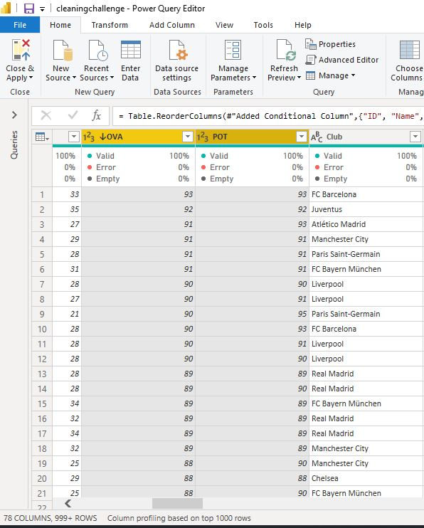 |  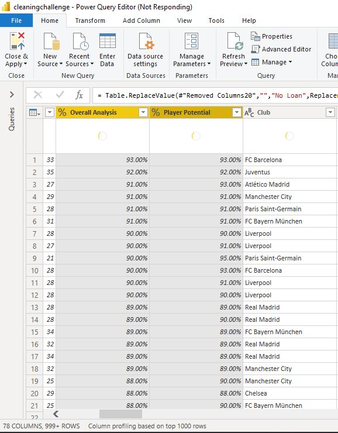 
 
  - **_Contract:_** This column had a delimiter (~) and was changed to hyphen (-). The start date and the end date were not splitted, rather, two (2) additional columns were created for agreement type and contract duration. The contract duration was calculated by subtraction the end date and the start date while the agreement type column consists of contract, free and loan. Agreement type was created using conditional column and the contract duration using M Language  
  
Before   |   After 
:-----------------------:|:-----------------------:
  |   

  - **_Height:_** The height column consist of two units centimeter and foot and inches. According to data dictionary, no unit was given to convert height to. So, I decided to convert the height to cm. The M Language was used to convert the foot and inches to centimeter. 1 foot = 30.48cm and 1 inche = 2.54cm e.g 
5’9” = 5 * 30.48cm + 9 * 2.54cm = 175cm

Before   |   After 
:-----------------------:|:-----------------------:
  |   
 
   - **_Weight:_** The weight column consists of two units kg and lbs. According to the data dictionary, we should convert weight to lbs. And this was done using the M Language and below is the code. 

Before   |   After 
:-----------------------:|:-----------------------:
 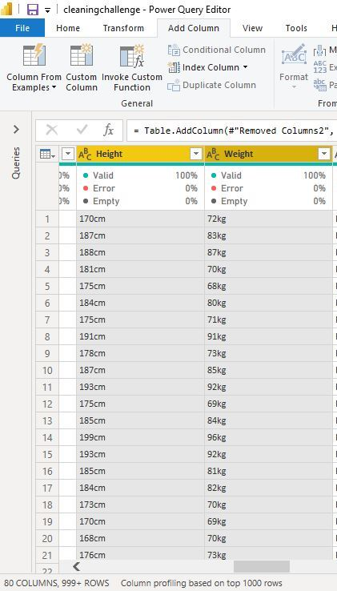 |  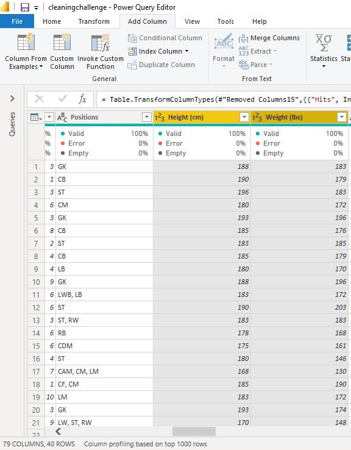 
 
 - **_Load End Date:_** It represents when the play’s loan ends. This column contained some empty column which was replaced with No Loan. 

Before   |   After 
:-----------------------:|:-----------------------:
  |   
 
  - **_Value, Wage and Release Clause:_** Represents the market value, weekly wage and release clause for each player. In this columns, thousands were denoted with K while Millions with M with and euro sign at the front. According to the data dictionary, all values should be in their normal forms and the pay is in euro. M Language ad conditional column was used to clean this column 

Before   |   After 
:-----------------------:|:-----------------------:
  |   
 
  - **_W/F, S/M and IR:_** means W/F Player’s weak foot rating, S/M Skill Move Rating and IR Injure Rating was measured and a scale of 1 – 5. Special character ★ was found among the dataset and was removed using the replace value and the data type was changed to whole number  

Before   |   After 
:-----------------------:|:-----------------------:
  |   

 - **_Hits:_** this refers to the number of times a player’s profile had been viewed on the websites. The column contains some blanks which mean the players had no views. Some player hits 1 thousand and was represented as 1K. The conditional column was used to quickly clean this by representing the K as 1000. And this is the last step of the cleaning process. 

Before   |   After 
:-----------------------:|:-----------------------:
 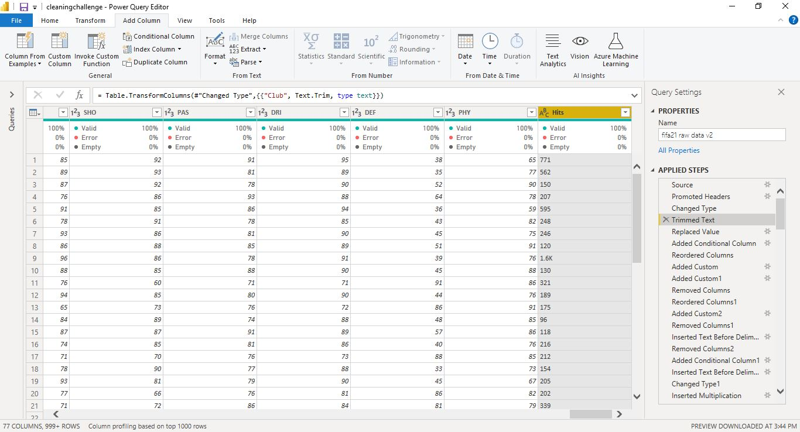 |  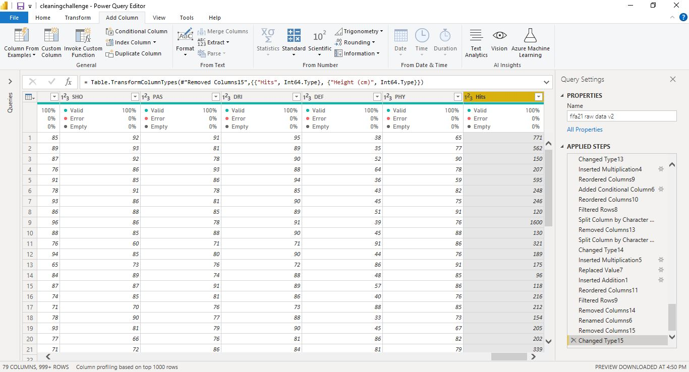 
 
  - **_Others:_** Columns such as ID, Longname, Nationality, Age, Preferred Foot, BOV, Best Position, Join, Attacking, Crossing, Finishing, Heading Accuracy, Short Passing, Volleys, Skill, Dribbling, Curve, FK Accuracy, Long Passing, Ball Control, Movement, Acceleration, Sprint Speed, Agility, Reactions, Balance, Power, Shot Power, Jumping, Stamina, Strength, Long Shots, Mentality, Aggression, Penalties, Interceptions, Positioning, Vision, Composure, Defending, Marking, Standing Tackle, Sliding Tackle, Goalkeeping, GK Diving, GK Handling, GK Kicking, GK Position, GK Reflexes, Total Stats, Base Stats, PAC, SHO, PAS, DRI, DEF and PHY  are OK and no cleaning was done on them.

# CONCLUSION
